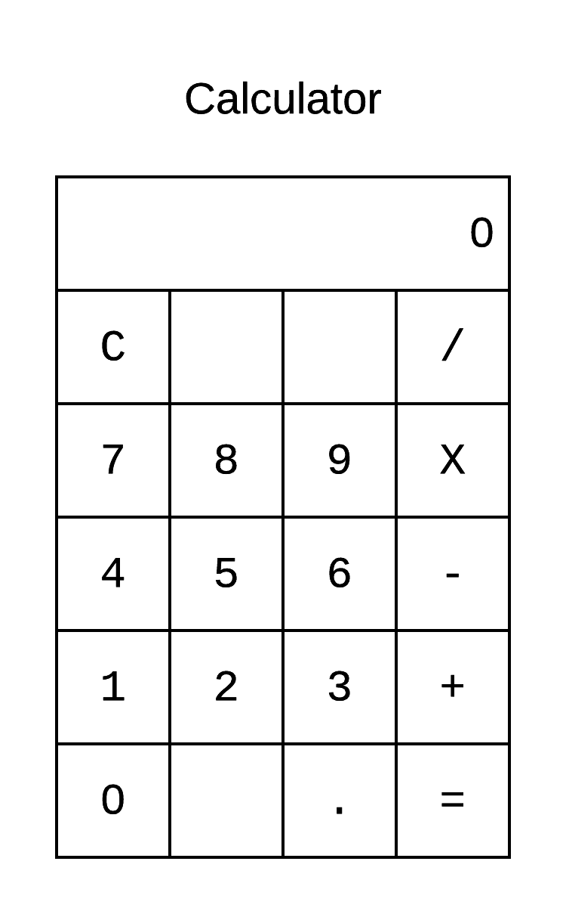

# Calculator

### Description

Create an in-browser calculator.

### MVP (Minimum Viable Product)

A working responsive calculator that can perform the basic operations described in the

#### Wireframe



#### Tech Stack

1. HTML
2. CSS
3. JS

### Objectives

To complete the assignment, you must complete the following:

###### Setup:

1. Create repo, for example: `exercise4-js-calculator`
2. Locally, navigate to your `sites` folder in the terminal
3. `git clone` + `your-repo-name` into your Sites folder
4. Create a `dev` branch to commit your code to
5. Create necessary files for application
6. Import necessary css/js files (Bootstrap)

###### Develop:

1. Add content and elements to your website
2. View changes locally with MAMP (localhost)
3. Save often, and commit to github when important changes happen

###### Deploy:

1. Push your code to Github remote
2. Post links to your Github repo to the projects and exercises Slack channel

### Application file structure

Minimally:

```
web/
    index.html - main page
    css/ - folder to contain CSS files
        /style.css - stylesheet
    img/ - folder to contain any images
    js/  - folder to contain JavaScript files
        /main.js
README.md - any important information
.gitignore - file that omits any directory/file from being tracked
```

Additional pages will be relative to the index.html file.

It is okay if your project has more files and more directories, but at the least you need the ones listed above.

### Requirements

1. The calculator should have a display area at the top.
2. The display should show `0` by default.
3. The calculator should have 6 function buttons:
   - Division `/`
   - Multiplication `*`
   - Subtraction `-`
   - Addition `+`
   - Calculate `=`
   - Clear `c`
4. The calculator should have 10 number buttons, `0-9`.
5. The calculator should have a decimal button `.`
6. The calculator should store three values internally:
   - The first number entered by the user (possibly multidigit and decimal)
   - The operator selected by the user `/`, `x`, `-`, `+`
   - The second number entered by the user (possibly multidigit and decimal)
7. The display area should update as a user presses number buttons.
8. When the user clicks a function button after the first and second values are entered (instead of `=`), the result of the calculation should be saved and the calculator should allow for a new number input (for example: `1` then `+` then `3` then `-`, etc.)
9. When the calculate button `=` is pressed, the calculator should apply the operation to the two stored numbers in the appropriate order (important for subtraction and division) and update the display.
10. When the clear button `c` is pressed, all stored data should be erased and the display should show `0` again.
11. Website must be responsive.

### Remember to push to Github!

Your repo should be public so that others can see your code and comment on it.

### If you finish early...

1. Show all buttons that were pressed until `c` in the display area.

```
Example:

  12 + 34
```

Continue to store two numbers and the operator; only the display
should change.

2. Allow an arbitrary amount of numbers and operators to be stored. (running log)
3. Use recursion to calculate the results.
4. Add info to your projects README.md [README.md Best Practices](https://gist.github.com/PurpleBooth/109311bb0361f32d87a2)
5. Add links and resources from this week to the [Class Resources Repo](https://github.com/bootcamp-students/Resources) by forking the repo and then initiating a pull request with your additions to the .md file.

### Too simple? Try...

1. Accept keyboard input
2. Undo button
3. Button that holds a value or function of choice (for example: button that automatically calculates the tip)
4. Graphing calculator

**If you get stuck...**

- [Class Resources Repo](https://github.com/bootcamp-students/Resources)
- Ask. :-)

**Additional Resouces**

- [Learn JS](https://www.w3schools.com/js/)

For more information about how computers do math and store memory, see these articles:

- [Computer math article](https://medium.com/swlh/how-computers-do-math-11af23139db)
- [Computer math examples](https://www.w3schools.com/js/js_numbers.asp)
- [Computer math common problem example](https://0.30000000000000004.com/)
- [Why do computers suck at math](https://blog.codinghorror.com/why-do-computers-suck-at-math/)

<!-- - [what is memory](https://www.computerhope.com/jargon/m/memory.htm)
- [how does javascript work with memory](https://hashnode.com/post/does-javascript-use-stack-or-heap-for-memory-allocation-or-both-cj5jl90xl01nh1twuv8ug0bjk) -->
