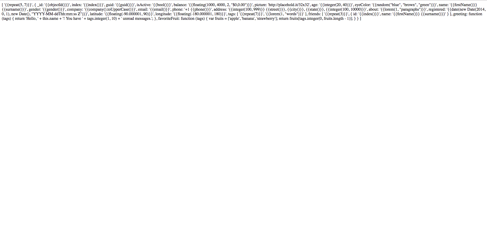

# PHP (Pretty Hefty Payload) Part 1 - Viewer

### Description

Create a webpage api that hosts data from your machine, viewable online as a JSON file

For this project we will be using vanilla php to create a webserver

### Table of contents

<!--ts-->

- [Project/Exercise Name](<#PHP-(Pretty-Hefty-Payload)-Part-1---Viewer>)
- [Description](#Description)
- [Table of Contents](#table-of-contents)
- [MVP (Minimum Viable Product)](#MVP)
  - [Wireframe](#Wireframe)
  - [Tech Stack](#Tech-Stack)
- [Process](#process)
  - [Setup](#Setup)
  - [Application File Structure](#Application-File-Structure)
  - [Develop](#Develop)
  - [Deploy](#Deploy)
- [Requirements](#Requirements)
  - [Additional Requirements](#Additional-Requirements)
  - [Stretch Goals](#Stretch-Goals)
- [Additional Resources](#Additional-Resources)
  <!--te-->

### MVP

By default, the app should POST JSON data from your machine to the internet.

#### Wireframe



#### Tech Stack

1. PHP

### Process

##### Setup:

1. Create repo, for example: `my-app`
2. Locally, navigate to your `sites` folder in the terminal
3. `git clone` + `your-repo-name` into your Sites folder
4. Create necessary files for application and view in VS Code
   - Run shell script to expedite process unless you are using a framework
   - _If you are using a framework, disregard the "Application File Structure" section_
     <!-- 5. Import and route necessary css/js files (E.g. Bootstrap) -->
5. Save all and create your first commit to `master`

###### Application File Structure

Minimally:

```
web/
    index.php - main page
README.md - any important information
.gitignore - file that omits any directory/file from being tracked
```

Additional pages will be relative to the index.html file.

It is okay if your project has more files and directories, but you at least need the ones listed above.

##### Develop:

1. Create a `dev` branch to commit your code to
2. View changes and test locally
3. Save often, and commit to your development branch on GitHub when important changes happen
4. Push your commits to GitHub remote

##### Deploy:

1. Create a Pull Request from `dev` into `master`
2. Confirm code is up to date and works correctly
3. Post links to your GitHub repo to the Projects and Exercises Slack channel

---

### Requirements

To complete the assignment, you must complete the following:

1. Use [JSON-Generator](https://www.json-generator.com/) to create random dummy JSON data, or if you already have data of your own, lint it through [JSONLint](https://jsonlint.com/) and store the file locally
2. Or optionally, dynamically create random data using PHP and using [JSON_Encode()](https://www.php.net/manual/en/function.json-encode.php), create the JSON file in the script itself
3. Create a single PHP webserver file that starts a connection on `localhost port 8080`
4. Point the webserver to the JSON file and create a POST request to view the data online via your [Public IP](https://www.whatismyip.com/)

#### Additional Requirements

<!-- - Website must be responsive -->
<!-- - Style your app as you wish -->

- Use the tools and technologies covered in class to complete your website. To see what we have covered, check the [Class Resources Repo](https://github.com/bootcamp-students/Resources).
- Your repo should be public so that others can see your code and comment on it.
  - _**Remember to push to GitHub!**_
  - Potential employers will view your GitHub profile, so activity is crucial!
  - _**Do not save your Public IP on GitHub, anyone can access your computer**_

#### Stretch Goals

- Create API credentials to only let users with the API key access the data

#### If you finish early...

1. Continue to add your own content, additions, and pages to your site and improve the styling.
2. Add info to your projects README.md [README.md Best Practices](https://gist.github.com/PurpleBooth/109311bb0361f32d87a2)
3. Add links and resources from this week to the [Class Resources Repo](https://github.com/bootcamp-students/Resources) by forking the repo and then initiating a pull request with your additions to the .md file.

### Additional Resources

- Ask questions :-)
- [Class Resources Repo](https://github.com/bootcamp-students/Resources)
- Learn more about [Good GitHub Practices](https://guides.github.com)
- [Learn PHP](https://www.w3schools.com/php/)
  <!-- - []() -->

For more information about PHP, see these articles:

- [Why Use PHP?](https://www.thoughtfulcode.com/why-use-php/)
- [PHP vs HTML](https://www.upwork.com/hiring/development/php-vs-html/)
- [PHP vs JS](https://www.guru99.com/php-vs-javascript.html)
