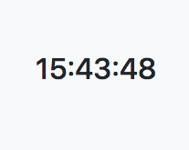

# Digital Clock

### Description

Create a webpage that displays the current time, in digital clock format

For this project we will be using the Date object and setInterval

### Table of contents

<!--ts-->

- [Project/Exercise Name](#Digital-Clock)
- [Description](#Description)
- [Table of Contents](#table-of-contents)
- [MVP (Minimum Viable Product)](#MVP)
  - [Wireframe](#Wireframe)
  - [Tech Stack](#Tech-Stack)
- [Process](#process)
  - [Setup](#Setup)
  - [Application File Structure](#Application-File-Structure)
  - [Develop](#Develop)
  - [Deploy](#Deploy)
- [Requirements](#Requirements)
  - [Additional Requirements](#Additional-Requirements)
  - [Stretch Goals](#Stretch-Goals)
- [Additional Resources](#Additional-Resources)
  <!--te-->

### MVP

By default, the app should display the time.

#### Wireframe



#### Tech Stack

1. HTML
2. CSS
3. JS

### Process

##### Setup:

1. Create repo, for example: `my-app`
2. Locally, navigate to your `sites` folder in the terminal
3. `git clone` + `your-repo-name` into your Sites folder
4. Create necessary files for application and view in VS Code
   - Run shell script to expedite process unless you are using a framework
   - _If you are using a framework, disregard the "Application File Structure" section_
5. Import and route necessary css/js files (E.g. Bootstrap)
6. Save all and create your first commit to `master`

###### Application File Structure

Minimally:

```
web/
    index.html - main page
    css/ - folder to contain CSS files
        style.css - main stylesheet
    img/ - folder to contain any images
    js/ - folder to contain JavaScript files
        main.js - main JavaScript file
README.md - any important information
.gitignore - file that omits any directory/file from being tracked
```

Additional pages will be relative to the index.html file.

It is okay if your project has more files and directories, but you at least need the ones listed above.

##### Develop:

1. Create a `dev` branch to commit your code to
2. Add content and elements to your website
3. View changes and test locally
4. Save often, and commit to your development branch on GitHub when important changes happen
5. Push your commits to GitHub remote
6. For bug fixes, refactored code, and feature branches, you must create a branch off of `dev` onto a `new-feature` branch and create a PR into dev when complete

##### Deploy:

1. Create a Pull Request from `dev` into `master`
2. Confirm code is up to date and works correctly
3. Post links to your GitHub repo to the Projects Slack channel

---

### Requirements

To complete the assignment, you must complete the following:

1. Display the current time
2. Make sure it updates every second without refreshing the page

#### Additional Requirements

- Website must be responsive
- Style your app as you wish
- Use the tools and technologies covered in class to complete your website. To see what we have covered, check the [Class Resources Repo](https://github.com/bootcamp-students/Resources).
- Your repo should be public so that others can see your code and comment on it.
  - _**Remember to push to GitHub!**_
  - Potential employers will view your GitHub profile, so activity is crucial!

#### Stretch Goals

- Change the font for the display; a mono-spaced font would look more like a digital clock, and it wouldn't jar your eyes as the variable-width string is re-centered every second.
- Add the date (day, month, and year)
- Make a button for toggling between a 12-hour and a 24-hour display
- Turn it into an ANALOG clock!

#### If you finish early...

1. Continue to add your own content, additions, and pages to your site and improve the styling.
2. Add info to your projects README.md [README.md Best Practices](https://gist.github.com/PurpleBooth/109311bb0361f32d87a2)
3. Add links and resources from this week to the [Class Resources Repo](https://github.com/bootcamp-students/Resources) by forking the repo and then initiating a pull request with your additions to the .md file.

### Additional Resources

- Ask questions :-)
- [Class Resources Repo](https://github.com/bootcamp-students/Resources)
- Learn more about [Good GitHub Practices](https://guides.github.com)
- [Learn JS](https://www.w3schools.com/js/)

For more information about coding time, see these articles:

- [The problem with coding time](https://www.youtube.com/watch?v=-5wpm-gesOY)
- [History Of Javascript](https://fireship.io/courses/javascript/intro-history/)
