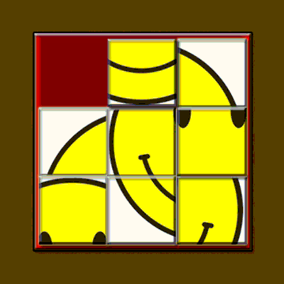

# Sliding Puzzle

### Description

Create a webpage that simulates a sliding puzzle

For this project we will be using vanilla javascript to dynamically parse the image and render the puzzle pieces in real time.

### Table of contents

<!--ts-->

- [Project/Exercise Name](#Sliding-Puzzle)
- [Description](#Description)
- [Table of Contents](#table-of-contents)
- [MVP (Minimum Viable Product)](#MVP)
  - [Wireframe](#Wireframe)
  - [Tech Stack](#Tech-Stack)
- [Process](#process)
  - [Setup](#Setup)
  - [Application File Structure](#Application-File-Structure)
  - [Develop](#Develop)
  - [Deploy](#Deploy)
- [Requirements](#Requirements)
  - [Additional Requirements](#Additional-Requirements)
  - [Stretch Goals](#Stretch-Goals)
- [Additional Resouces](#Additional-Resouces)
  <!--te-->

### MVP

By default, the app should allow a user to click on a tile and it move in a direction, until the puzzle reaches a win condition.

#### Wireframe



#### Tech Stack

1. HTML
2. CSS
3. JS

### Process

##### Setup:

1. Create repo, for example: `my-app`
2. Locally, navigate to your `sites` folder in the terminal
3. `git clone` + `your-repo-name` into your Sites folder
4. Create necessary files for application and view in VS Code
   - Run shell script to expedite process unless you are using a framework
   - _If you are using a framework, disregard the "Application File Structure" section_
5. Import and route necessary css/js files (E.g. Bootstrap)
6. Save all and create your first commit to `master`

###### Application File Structure

Minimally:

```
web/
    index.html - main page
    css/ - folder to contain CSS files
        /style.css - stylesheet
    img/ - folder to contain any images
    js/ - folder to contain JavaScript files
        /main.js
README.md - any important information
.gitignore - file that omits any directory/file from being tracked
```

Additional pages will be relative to the index.html file.

It is okay if your project has more files and more directories, but at the least you need the ones listed above.

##### Develop:

1. Create a `dev` branch to commit your code to
2. Add content and elements to your website
3. View changes and test locally
4. Save often, and commit to your development branch on GitHub when important changes happen
5. Push your commits to GitHub remote

##### Deploy:

1. Create a Pull Request from `dev` into `master`
2. Confirm code is up to date and works correctly
3. Post links to your GitHub repo to the Projects and Exercises Slack channel

---

### Requirements

To complete the assignment, you must complete the following:

1. Pass as input, any image for the puzzle app to upload to the site. This can be done with a drag and drop, or a "choose file" option, and should be able to happen at any time, not just once
2. Dynamically parse the uploaded image into a 3 x 3 equal sized square grid leaving the bottom left hand corner out.
3. Have a button that "shuffles" the board and that can be pressed at any time. This button should not accidentally solve the board.
4. Be able to click on any piece and if it is able to be moved into a new spot, move that piece, otherwise, do nothing.
5. If you click the final puzzle piece into place, the game should be able to display "winner" and let the user play again _and also_ allow the user to continue clicking the puzzle pieces to shuffle it themselves.
6. All styling and image parsing must be done dynamically, including the win conditions. No hard coding.

#### Additional Requirements

- Website must be responsive
- Style your app as you wish
- Use the tools and technologies covered in class to complete your website. To see what we have covered, check the [Class Resources Repo](https://github.com/bootcamp-students/Resources).
- Your repo should be public so that others can see your code and comment on it.
  - _**Remember to push to GitHub!**_
  - Potential employers will view your GitHub profile, so activity is crucial!

#### Stretch Goals

- Allow the puzzle to be any dimensions (5x4, 2x10, etc)
- Allow the tiles to be any shape (triangle, hexagon, etc)
- Make a [Rubik's Cube](https://www.google.com/logos/2014/rubiks/iframe/index.html)

#### If you finish early...

1. Continue to add your own content, additions, and pages to your site and improve the styling.
2. Add info to your projects README.md [README.md Best Practices](https://gist.github.com/PurpleBooth/109311bb0361f32d87a2)
3. Add links and resources from this week to the [Class Resources Repo](https://github.com/bootcamp-students/Resources) by forking the repo and then initiating a pull request with your additions to the .md file.

### Additional Resouces

- Ask questions :-)
- [Class Resources Repo](https://github.com/bootcamp-students/Resources)
- Learn more about [Good GitHub Practices](https://guides.github.com)
- [Learn JS](https://www.w3schools.com/js/)
- []()

For more information about **_doing something_**, see these articles:

- []()
- []()
- []()
