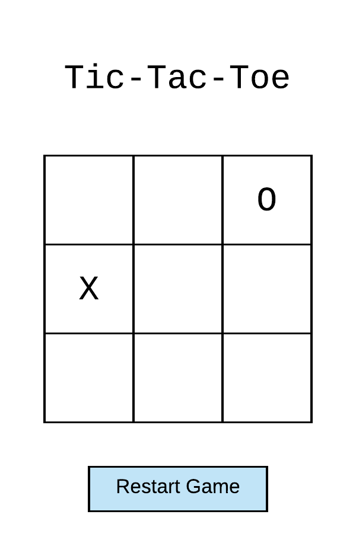

# Tic Tac Toe

### Description

Create a webpage that recreates the childhood classic game, tic-tac-toe, in JavaScript.

See [https://en.wikipedia.org/wiki/Tic-tac-toe](https://en.wikipedia.org/wiki/Tic-tac-toe) for more information.
<!-- For this project we will be using **_something_** -->


### Table of contents

<!--ts-->

- [Project/Exercise Name](#Tic-Tac-Toe)
- [Description](#Description)
- [Table of Contents](#table-of-contents)
- [MVP (Minimum Viable Product)](#MVP)
  - [Wireframe](#Wireframe)
  - [Tech Stack](#Tech-Stack)
- [Process](#process)
  - [Setup](#Setup)
  - [Application File Structure](#Application-File-Structure)
  - [Develop](#Develop)
  - [Deploy](#Deploy)
- [Requirements](#Requirements)
  - [Additional Requirements](#Additional-Requirements)
  - [Stretch Goals](#Stretch-Goals)
- [Additional Resouces](#Additional-Resouces)
  <!--te-->

### MVP

By default, the app should do the following

1. Use the symbols X and O.
2. On each players turn, that player places one of their symbols on an
   unoccupied space by clicking.
3. The game continues until one player places three symbols in a
   straight line (horizontal, vertical, or diagonal) and wins or there are no
   remaining available spaces and it is a draw.

#### Wireframe



#### Tech Stack

1. HTML
2. CSS
3. JS

### Process

##### Setup:

1. Create repo, for example: `my-app`
2. Locally, navigate to your `sites` folder in the terminal
3. `git clone` + `your-repo-name` into your Sites folder
4. Create necessary files for application and view in VS Code
   - Run shell script to expedite process unless you are using a framework
   - _If you are using a framework, disregard the "Application File Structure" section_
5. Import and route necessary css/js files (E.g. Bootstrap)
6. Save all and create your first commit to `master`

###### Application File Structure

Minimally:

```
web/
    index.html - main page
    css/ - folder to contain CSS files
        /style.css - stylesheet
    img/ - folder to contain any images
    js/ - folder to contain JavaScript files
        /main.js
README.md - any important information
.gitignore - file that omits any directory/file from being tracked
```

Additional pages will be relative to the index.html file.

It is okay if your project has more files and more directories, but at the least you need the ones listed above.

##### Develop:

4. Create a `dev` branch to commit your code to
1. Add content and elements to your website
1. View changes and test locally
1. Save often, and commit to your development branch on GitHub when important changes happen
1. Push your commits to GitHub remote

##### Deploy:

1. Create a Pull Request from `dev` into `master`
2. Confirm code is up to date and works correctly
3. Post links to your GitHub repo to the Projects and Exercises Slack channel

---

### Requirements

To complete the assignment, you must complete the following:

1. The board should be dynamically rendered
2. The game should let the players know whos turn it is
3. Game tiles should only be clickable once
4. The game should display who wins the game if someone wins, otherwise say that the game resulted in a tie
5. Include a Restart Game button that does not refresh the page, only reset the game

#### Additional Requirements

- Website must be responsive
- Style your app as you wish
- Use the tools and technologies covered in class to complete your website. To see what we have covered, check the [Class Resources Repo](https://github.com/bootcamp-students/Resources).
- Your repo should be public so that others can see your code and comment on it.
  - _**Remember to push to GitHub!**_
  - Potential employers will view your GitHub profile, so activity is crucial!

#### Stretch Goals
- Allow players to enter their names.
- Keep track of number of games won by X and O.
- Add a link to rules, display in a modal.
- Recreate Checkers.
- Recreate Othello.
- Recreate Go.
- Recreate Chess.
- Create an AI to beat whoever plays, every time.

#### If you finish early...

1. Continue to add your own content, additions, and pages to your site and improve the styling.
2. Add info to your projects README.md [README.md Best Practices](https://gist.github.com/PurpleBooth/109311bb0361f32d87a2)
3. Add links and resources from this week to the [Class Resources Repo](https://github.com/bootcamp-students/Resources) by forking the repo and then initiating a pull request with your additions to the .md file.

### Additional Resouces

- Ask questions :-)
- [Class Resources Repo](https://github.com/bootcamp-students/Resources)
- Learn more about [Good GitHub Practices](https://guides.github.com)
- [Learn JS](https://www.w3schools.com/js/)
<!-- - []() -->

For more information about games and code, see these articles:

- [AlphaGo - Netflix](https://www.netflix.com/title/80190844?s=i&trkid=13747225)
- [Are Computers Playing Games With Us?](https://www.huffpost.com/entry/computer-game-intelligence_b_1396377)
<!-- - []() -->
