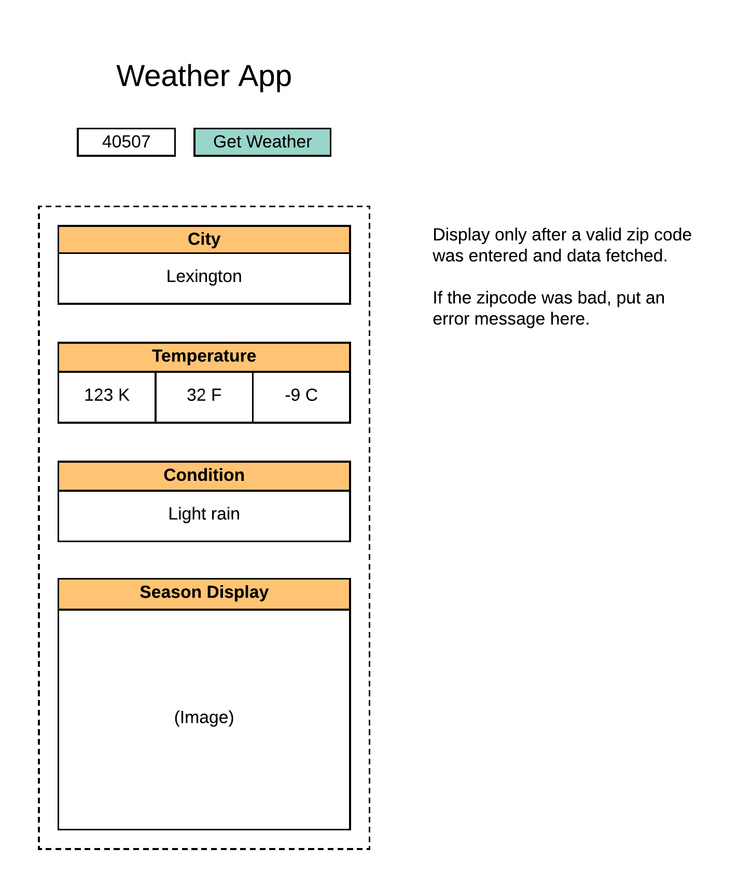

# Weather App

### Description

Create a webpage that prompts users to enter a zipcode, then displays current weather information for that location or a friendly error message if the zipcode is not found.

For this project we will be using an external API to retrieve weather data.


### Table of contents

<!--ts-->

- [Project/Exercise Name](#Weather-App)
- [Description](#Description)
- [Table of Contents](#table-of-contents)
- [MVP (Minimum Viable Product)](#MVP)
  - [Wireframe](#Wireframe)
  - [Tech Stack](#Tech-Stack)
- [Process](#process)
  - [Setup](#Setup)
  - [Application File Structure](#Application-File-Structure)
  - [Develop](#Develop)
  - [Deploy](#Deploy)
- [Requirements](#Requirements)
  - [Additional Requirements](#Additional-Requirements)
  - [Stretch Goals](#Stretch-Goals)
- [Additional Resouces](#Additional-Resouces)
  <!--te-->

### MVP

By default, the app should display a title, input box for zipcode, and submit button.

When the submit button is clicked, the application should fetch weather data from [api.openweathermap.org](api.openweathermap.org).

#### Wireframe



#### Tech Stack

1. HTML
2. CSS
3. JS

### Process

##### Setup:

1. Create repo, for example: `my-app`
2. Locally, navigate to your `sites` folder in the terminal
3. `git clone` + `your-repo-name` into your Sites folder
4. Create necessary files for application and view in VS Code
   - Run shell script to expedite process unless you are using a framework
   - _If you are using a framework, disregard the "Application File Structure" section_
5. Import and route necessary css/js files (E.g. Bootstrap)
6. Save all and create your first commit to `master`

###### Application File Structure

Minimally:

```
web/
    index.html - main page
    css/ - folder to contain CSS files
        /style.css - stylesheet
    img/ - folder to contain any images
    js/ - folder to contain JavaScript files
        /main.js
README.md - any important information
.gitignore - file that omits any directory/file from being tracked
```

Additional pages will be relative to the index.html file.

It is okay if your project has more files and more directories, but at the least you need the ones listed above.

##### Develop:

4. Create a `dev` branch to commit your code to
1. Add content and elements to your website
1. View changes and test locally
1. Save often, and commit to your development branch on GitHub when important changes happen
1. Push your commits to GitHub remote

##### Deploy:

1. Create a Pull Request from `dev` into `master`
2. Confirm code is up to date and works correctly
3. Post links to your GitHub repo to the Projects and Exercises Slack channel

---

### Requirements

To complete the assignment, you must complete the following:

1. Allow the user to enter their location (zip code is probably easiest) and press a button to load the weather by creating an API GET request
2. If the request is successful, display the following in a 'mobile app' format:
  - City name
  - Current weather conditions
  - Current temperature in Kelvin, Fahrenheit, and Celius
  - A unique image, selected by the current temperature (The API has icons)
3. If the request is unsuccessful, display a specific error message.

#### Additional Requirements

- Website must be responsive
- Style your app as you wish
- Use the tools and technologies covered in class to complete your website. To see what we have covered, check the [Class Resources Repo](https://github.com/bootcamp-students/Resources).
- Your repo should be public so that others can see your code and comment on it.
  - _**Remember to push to GitHub!**_
  - Potential employers will view your GitHub profile, so activity is crucial!

#### Stretch Goals

- Get weather based on location data (no need for user input)
- Use more data provided by the api (forecast data, historical data, daily change in weather, etc.)


#### If you finish early...

1. Continue to add your own content, additions, and pages to your site and improve the styling.
2. Add info to your projects README.md [README.md Best Practices](https://gist.github.com/PurpleBooth/109311bb0361f32d87a2)
3. Add links and resources from this week to the [Class Resources Repo](https://github.com/bootcamp-students/Resources) by forking the repo and then initiating a pull request with your additions to the .md file.

### Additional Resouces

- Ask questions :-)
- [Class Resources Repo](https://github.com/bootcamp-students/Resources)
- Learn more about [Good GitHub Practices](https://guides.github.com)
- [Learn JS](https://www.w3schools.com/js/)
- [PWA intro](https://developers.google.com/web/fundamentals/codelabs/your-first-pwapp/)

For more information about using API's, see these articles:

- [W3 schools local storage](https://www.w3schools.com/html/html5_webstorage.asp)
- [API call / timeout visualization](http://latentflip.com/loupe/?code=JC5vbignYnV0dG9uJywgJ2NsaWNrJywgZnVuY3Rpb24gb25DbGljaygpIHsKICAgIHNldFRpbWVvdXQoZnVuY3Rpb24gdGltZXIoKSB7CiAgICAgICAgY29uc29sZS5sb2coJ1lvdSBjbGlja2VkIHRoZSBidXR0b24hJyk7ICAgIAogICAgfSwgMjAwMCk7Cn0pOwoKY29uc29sZS5sb2coIkhpISIpOwoKc2V0VGltZW91dChmdW5jdGlvbiB0aW1lb3V0KCkgewogICAgY29uc29sZS5sb2coIkNsaWNrIHRoZSBidXR0b24hIik7Cn0sIDUwMDApOwoKY29uc29sZS5sb2coIldlbGNvbWUgdG8gbG91cGUuIik7!!!PGJ1dHRvbj5DbGljayBtZSE8L2J1dHRvbj4%3D)
